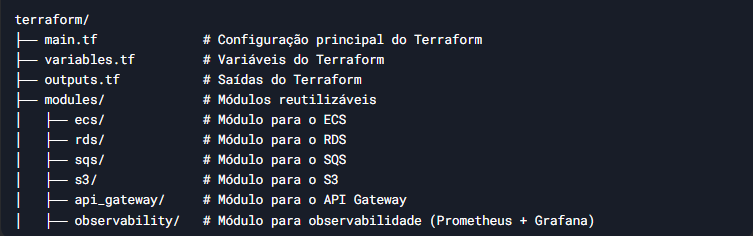

# fluxo-de-caixa-consolidacao
Versiona a consolidação dos lançamento de fluxo de caixa.

# Antes de rodar o projeto é necessario a infra instalada ou rode direto na AWS.
 
 
 Para verificar a infra clique [aqui](https://github.com/romymoura/fluxo-de-caixa-infra)

Veremos abaixo o que foi utilizado.
	* .Net 8 com C#, API Rest Full, 
	Worker					-> Para consumir as mensagens geradas pela API
	SQS						-> Contém a mensagem contendo o lançamento de (Débito ou Crédito)
	S3						-> Para Receber o arquivo de consolidação dos valores do caixa.
	AutoMapper				-> Para o suporte de transacionar informações entres as camadas 
	Fluent Validation		-> Adicionado com a intenção de validar entrada e saídas de dados (Instrumentado) 
	Serilog					-> Para dossa observabilidade
* TDD
	Adicionado uma pequeno exemplar de cobetura de codigo gerando o dash para melhor visualização de cobertura.

* DDD
	Seguindo o conceitos do DDD (Domain-Driven Design, ou Design Orientado a Domínio) mesclado com SOLID, onde 
	tentei da melhor maneira desacoplar os compo_
	nentes e suas camadas mesmo utilizando um template robusto para a tarefa.

	Acredito que fiz toda cobertura necessária
	S -> Single Responsibility Principle (Princípio da Responsabilidade Única) as camadas e os serviços assumem este 
	comportamento

	O -> Open/Closed Principle (Princípio Aberto/Fechado) com a utilização de heranças, interfaces para estender o 
	comportamento.

	L -> Liskov Substitution Principle (Princípio da Substituição de Liskov) este princípio está implementado 
	principalmente na camada da ORM, nossa classe base das repositories, onde é criado hierarqui de classe, 
	respeitando o comportamento.

	I -> Interface Segregation Principle (Princípio da Segregação de Interfaces) o projeto todo foi desenvolvido 
	pensando na separação de responsabilidade isso leva a uma situação que precisamos ter interfaces distintas.

	D -> Dependency Inversion Principle (Princípio da Inversão de Dependência) A injeção de dependencia ajuda
	seguir este princípio, pois nenhuma service depende de uma repository.

# Serviço de lançamento (Débito e Crédito)
 Este serviço é a porta de entrada, são os laçamentos da caixa registradora, para validar clique [aqui](https://github.com/romymoura/fluxo-de-caixa-lancamento)
